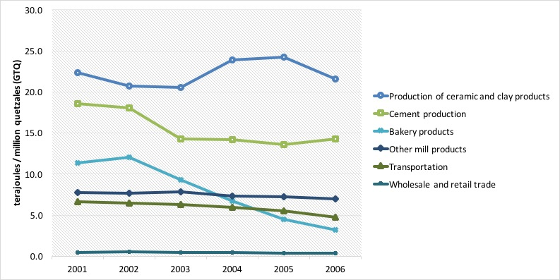

## Summary

Natural capital accounting showed that Guatemala is a country whose main source of energy is fuelwood, and it also made clear that the production of electricity is the largest individual user of energy of all kinds, taking up to 3.3 units of energy in other forms to produce one unit of electricity.

This account is a framework that allows us to understand the intricate relationship between the environment and the economy in terms of energy resources, and at the same time quantify the emissions that result from the combustion of the different types of energy.

In the last year of the analysis, there was an energy consumption of 483,947 terajoules.

Around 46% of all the energy consumed can be attributed to household final use, where fuelwood, gasoline, and electricity are predominant.

The production of electricity used about 13% of all energy consumption, equivalent to 61,594 TJ.

Among the relevant players in the consumption of energy we found the production of bakery products (3.6% of total use), transportation (3.5%), grain milling (3.3%), cement production (2.6%), wholesale and retail trade (2.2%), restaurants and bars (1.1%), sugar milling (1%), and the production of soaps and detergents (1%).

From the combustion of energy, a total of 45.6 million CO2 tons equivalent were emitted to the atmosphere, of which the 5 largest emitters (excluding households) were responsible for 11.6 million CO2 tons equivalent or 64%. Households emitted around 27.5 million CO2 tons equivalent.

In terms of intensity, a measure that compares energy use with value added generation, we have that the electricity generation industry requires 14.2 terajoules for every million quetzales (GTQ) that it contributes to GDP, which contrasts with the average for manufactures (2.9 TJ for every million GTQ), or trade activities that circle below 1 TJ for every million GTQ of value added.

<figure>

</figure>

## Services performed

* Developed national indicators for the System of Environmental and Economic National Accounts ‘green accounting system’, a satellite system within BANGUAT's National Accounts. 
* Created a system for quantifying the links between the economy and the use of energy before the creation of the SEEA Energy manual.
* Implemented a database format to combine information from all environmental accounts, which has gradually been adopted in other countries as well.
* Presented the SEEA Guatemala system at the United Nations and contributed to the UN London Group on environmental accounts.
* Won award from the UN Economic Commission for Latin America for the system.
